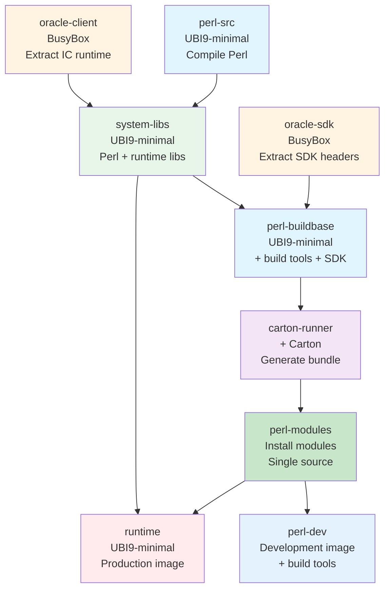

# Perl Multi-Stage Container Build with Carton

Complete multi-stage Podman/Docker workflow for building Perl applications with reproducible, offline-capable dependency management using Carton.

## Key Features

- **Fully Offline Builds**: Once bundle is generated, builds work without internet access
- **Deterministic Dependencies**: Bundle hash based on `cpanfile.snapshot` ensures reproducibility
- **Version Traceability**: Images tagged with bundle hash for full dependency lineage
- **Minimal Runtime**: Production image contains no compilers, build tools, or Carton
- **Comprehensive Testing**: Quick smoke tests and full CPAN test suites
- **Flexible Test Configuration**: Per-module test customization with environment variables and custom commands

## Quick Start

### 1. Check Status

```bash
make status
```

Shows current state of dependencies, bundles, and images with color-coded output.

### 2. Generate CPAN Bundle

```bash
make bundle
```

Computes a hash from `cpanfile.snapshot`, builds the carton-runner stage, generates a CPAN mirror bundle, and saves it as `bundles/bundle-<hash>.tar.gz`.

### 3. Build Images

```bash
make all       # Build both dev and runtime images
# or individually:
make dev       # Build development image only
make runtime   # Build runtime image only
```

Images are tagged with bundle hash labels:
- `myapp:dev-<hash>` and `myapp:dev`
- `myapp:runtime-<hash>` and `myapp:runtime`

### 4. Test Libraries

```bash
# Quick smoke test (verify all modules can be loaded)
make test-load-dev       # Test dev image
make test-load-runtime   # Test runtime image

# Full CPAN test suites (dev only - slow but thorough)
make test-full                    # Run all test suites
make test-full MODULE=DBI         # Test single module
```

**Note:**
- Full test suites only run on `dev` image (runtime lacks build tools)
- Module loading tests work on both dev and runtime

### 5. Run Application

```bash
podman run --rm myapp:dev       # Development image
podman run --rm myapp:runtime   # Production image
```

## Makefile Targets

```bash
make help                     # Show available targets with descriptions
make status                   # Check status of bundles and images
make bundle                   # Generate CPAN bundle from cpanfile.snapshot
make dev                      # Build development image (myapp:dev)
make runtime                  # Build runtime image (myapp:runtime)
make all                      # Generate bundle and build both images
make test-load-dev            # Quick: verify all modules load in dev image
make test-load-runtime        # Quick: verify all modules load in runtime image
make test-full                # Full: run CPAN test suites (parallel, all CPUs)
make test-full MODULE=name    # Full: run CPAN test suite for single module
make clean                    # Remove images (bundles are preserved)
```

### Checking Status

The `status` target provides a comprehensive view with color-coded output:

```bash
make status
```

Shows:
- Current cpanfile.snapshot hash and git status
- Bundle existence and version alignment
- Image status with bundle hash labels
- Recommended commands to sync everything

## Testing System

### Quick Smoke Tests

Fast module loading test to verify all dependencies are installed:

```bash
make test-load    # Test dev image (~5 seconds)
```

Uses `tests/module-load-test.pl` to attempt loading each module from cpanfile.

**Note:** Only runs on `dev` image, as `runtime` lacks build tools for testing.

### Full Test Suites

Comprehensive testing that runs complete CPAN test suites for all modules:

```bash
make test-full                    # Full tests (parallel, ~5-10 minutes)
make test-full MODULE=DBI         # Test single module (sequential)
```

**Features:**
- Runs `cpanm --test-only --verbose` for each module
- Saves timestamped reports to `test-reports/` directory
- Summary report shows pass/fail/skip counts
- Detail reports vary by mode:
  - **Full test run**: One `.log` file per **failed** module only
  - **Single module**: Always generates a `.log` file with full output, even on success

### Test Configuration

Configure module-specific test behavior in `tests/test-config.conf`:

```ini
[ModuleName]
skip_load = yes|no          # Skip in quick smoke test
skip_test = yes|no          # Skip in full CPAN test suite
reason = text               # Why skipping (shows in reports)
env.VAR_NAME = value        # Set environment variable before testing
test_command = command      # Custom test command (overrides default)
```

**Examples:**

```ini
# Skip build-time dependencies
[Devel::CheckLib]
skip_load = yes
skip_test = yes
reason = Build-time only dependency

# Set environment for database drivers
[DBD::Oracle]
env.ORACLE_HOME = /opt/oracle/instantclient
env.LD_LIBRARY_PATH = /opt/oracle/instantclient
reason = Requires Oracle client libraries

# Use custom test command for problematic modules
[Problem::Module]
test_command = cpanm --test-only --force Problem::Module
reason = Some tests are flaky but module works
```

See `tests/README.md` for complete documentation.

## Architecture

This project implements a **nine-stage** optimized multi-stage build process with a shared runtime foundation:

### Build Stages Flow



### Stage Flow Explained

**Extraction Stages (BusyBox ~1.5MB):**
- `oracle-client` → Extracts Oracle Instant Client runtime libraries
- `oracle-sdk` → Extracts Oracle SDK headers for DBD::Oracle compilation

**Foundation Stage (UBI9-minimal):**
- `perl-src` → Compiles Perl from source
- `system-libs` → Shared base with Perl + runtime libraries (used by both dev & production)

**Build Stages:**
- `perl-buildbase` → Extends system-libs with build tools
- `carton-runner` → Generates CPAN bundle (Carton isolated here)
- `perl-modules` → Installs all CPAN modules once (DRY principle)

**Final Images:**
- `perl-dev` → Full development environment with build tools (copies modules from perl-modules)
- `runtime` → Minimal production image (copies modules from perl-modules, no build tools)

### Stage Details

#### Stage 1: perl-src (UBI9-minimal)
**Purpose:** Compile Perl from source with custom configuration
- Compiles Perl 5.28.1 with thread support (`-Dusethreads`)
- Builds shared Perl library (`-Duseshrplib`)
- Installs to `/opt/perl`
- Source downloaded to `artifacts/perl-${VERSION}.tar.gz`

#### Stage 2: oracle-client (BusyBox ~1.5MB)
**Purpose:** Extract Oracle Instant Client runtime libraries
- Uses minimal BusyBox image (unzip utility only)
- Extracts `instantclient-basiclite*.zip` → runtime shared libraries
- Base layer discarded; only extracted files (`/opt/oracle/instantclient`) copied forward
- **Layer optimization:** Zip file never reaches final images

#### Stage 3: oracle-sdk (BusyBox ~1.5MB)
**Purpose:** Extract Oracle SDK headers for DBD::Oracle compilation
- Uses minimal BusyBox image (unzip utility only)
- Extracts `instantclient-sdk*.zip` → SDK headers
- Only SDK directory (`/opt/oracle/instantclient-sdk`) copied to perl-buildbase
- **Critical for layer optimization:** Prevents ~80MB zip from polluting dev image layers

#### Stage 4: system-libs (UBI9-minimal)
**Purpose:** Shared runtime foundation for both dev and production
- Copies compiled Perl from `perl-src`
- Copies Oracle Instant Client libraries from `oracle-client` (basiclite only, no SDK)
- Installs runtime system libraries:
  - Database drivers: `libpq`, `mariadb-connector-c`, `libaio`
  - Image processing: `gd`, `libpng`, `libjpeg-turbo`, `freetype`
  - XML/compression: `libxml2`, `libxslt`, `zlib`, `bzip2-libs`, `xz-libs`
  - Core: `openssl-libs`, `expat`, `libdb`
- **NO build tools or -devel packages** (runtime only)
- Used as base for both `perl-buildbase` (adds tools) and `runtime` (uses directly)
- **Guarantees identical runtime environment** between dev and production

#### Stage 5: perl-buildbase (extends system-libs)
**Purpose:** Add build environment for compiling XS modules
- Inherits all runtime libraries from `system-libs`
- Installs build tools: `gcc`, `make`, `perl-core`, `perl-devel`
- Installs development headers (`*-devel` packages matching runtime libs)
- Copies Oracle SDK from `oracle-sdk` stage (**no zip files in layers!**)
- Used for: compiling XS modules, running CPAN tests, building bundles

#### Stage 6: carton-runner (extends perl-buildbase)
**Purpose:** Generate offline CPAN dependency bundle
- Installs `cpanm` (fatpacked) and Carton
- Runs `carton install --deployment` to lock dependencies
- Runs `carton bundle` to create offline CPAN mirror
- Creates `cpan-bundle.tar.gz` with vendor cache
- **Carton isolation:** Carton only exists in this stage (not in dev or runtime)

#### Stage 7: perl-modules (extends perl-buildbase)
**Purpose:** Install all CPAN modules once (single source of truth)
- Extends `perl-buildbase` (needs build tools for XS modules)
- Extracts CPAN bundle from `bundles/bundle-latest.tar.gz`
- Installs all dependencies offline using `cpm` with local resolver
- Cleans up build artifacts (`~/.perl-cpm`, extracted bundle)
- **Result:** Clean `/opt/perl/lib/perl5` with all installed modules
- **DRY principle:** Both `perl-dev` and `runtime` copy from here
- **Layer optimization:** Provides clean source without build artifacts

#### Stage 8: perl-dev (extends perl-buildbase)
**Purpose:** Development image with build tools
- Inherits build tools from `perl-buildbase` (gcc, make, etc.)
- **Copies** installed modules from `perl-modules` stage (no installation!)
- Includes dependency files for reference (`cpanfile`, `cpanfile.snapshot`)
- Full development environment with:
  - All CPAN modules installed
  - Build tools for compiling new modules
  - Development headers for XS modules
- **No zip files** thanks to BusyBox extraction stages

#### Stage 9: runtime (extends system-libs)
**Purpose:** Minimal production image
- Inherits from `system-libs` (clean runtime base, no build tools)
- **Copies** installed modules from `perl-modules` stage (not perl-dev!)
- **Layer efficiency:** Copies from clean source without build tool bloat
- **Minimal attack surface:**
  - NO compilers (`gcc`, `make`)
  - NO build tools or `-devel` packages
  - NO Carton or bundle files
  - NO zip files
- Runs as non-root user: `appuser` (UID 1001)
- Production-ready with smallest footprint

### Key Design Principles

- **Shared Runtime Base**: system-libs ensures dev and production have identical runtime dependencies
- **Single Module Installation (DRY)**: perl-modules stage installs all CPAN modules once
  - Both perl-dev and runtime copy from perl-modules (no duplicate installation)
  - Guarantees identical module versions between dev and production
  - Faster builds: modules installed once, copied twice
- **Layer Optimization**: BusyBox used for extraction-only stages (oracle-client, oracle-sdk)
  - Prevents zip files from polluting image layers
  - Multi-stage COPY only brings extracted files forward
  - ~100x smaller base (1.5MB vs 140MB) for utility stages
- **Build Tool Isolation**: Compilers and build tools isolated to perl-buildbase lineage, never reach runtime
  - Runtime copies from perl-modules (clean) not perl-dev (has build tools)
  - True separation: runtime never inherits from build stages
- **Offline Capability**: Bundle contains complete CPAN mirror for reproducible offline builds
- **Security**: Runtime runs as non-root user with minimal attack surface
- **True Layer Efficiency**: No deleted files wasting space in layer history

## Project Structure

```
.
├── Containerfile              # Multi-stage build definition
├── Makefile                   # Build automation
├── cpanfile                   # Perl dependencies
├── cpanfile.snapshot          # Locked dependency versions
├── app/
│   └── app.pl                 # Application code
├── artifacts/                 # Pre-downloaded build artifacts
│   ├── perl-5.28.1.tar.gz
│   ├── cpanm                  # cpanm fatpack
│   ├── cpm                    # cpm fatpack
│   └── instantclient-*.zip    # Oracle Instant Client
├── scripts/                   # Build and management scripts
│   ├── bundle-create.sh       # CPAN bundle and dependency manager
│   ├── build-image.sh         # Container image builder
│   ├── status.sh              # Bundle and image status checker
│   ├── test-load-modules.sh   # Quick module smoke test runner
│   └── test-run-suites.sh     # Full CPAN test suite runner
├── tests/                     # Test configuration and scripts
│   ├── test-config.conf       # Module test configuration
│   ├── TestConfig.pm          # Configuration parser
│   ├── module-load-test.pl    # Quick smoke test script
│   ├── test-suite-runner.pl   # Full test suite runner
│   └── README.md              # Test system documentation
├── bundles/                   # Generated CPAN bundles
│   ├── bundle-<hash>.tar.gz   # Content-addressed bundles
│   └── bundle-latest.tar.gz   # Symlink to latest bundle
└── test-reports/              # Test result reports (gitignored)
    ├── dev-TIMESTAMP-summary.txt
    └── dev-TIMESTAMP-details/
        ├── Module1.log
        └── Module2.log
```

## Daily Workflow

### Adding New Dependencies

1. Edit `cpanfile` to add new modules
2. Regenerate bundle: `make bundle`
3. Rebuild images: `make all`
4. Quick test: `make test-load`
5. Full test (optional): `make test-full`

The new bundle will have a different hash, ensuring full traceability.

### Updating Existing Dependencies

#### Update to Latest Versions

Use the `bundle-create.sh` script to update to the latest versions:

```bash
# Update all dependencies to latest versions
./scripts/bundle-create.sh update --all

# Update specific module to latest version
./scripts/bundle-create.sh update --module DBI
```

After updating, regenerate the bundle:
```bash
make bundle
```

#### Pin to Specific Version

To update a module to a specific version, manually edit `cpanfile`:

```perl
# Pin to exact version
requires 'DBI', '== 1.643';

# Pin to minimum version
requires 'DBI', '>= 1.643';

# Version range
requires 'DBI', '>= 1.640, < 2.0';
```

Then update the snapshot and regenerate the bundle:
```bash
./scripts/bundle-create.sh update --module DBI
make bundle
```

**Note:** Carton doesn't support version pinning via CLI. Manual cpanfile editing is required for version constraints.

### Debugging Test Failures

When `make test-full` fails:

1. Check the summary output for failed module list
2. Review detailed failure logs in `test-reports/full-TIMESTAMP-details/`
3. Test individual module: `make test-full MODULE=FailedModule`
3. The detail report contains **only failed tests** with full verbose output
4. Configure problematic modules in `tests/test-config.conf`:
   - Skip tests: `skip_test = yes`
   - Set environment: `env.VAR_NAME = value`
   - Use custom command: `test_command = ...`

### Configuring Module Tests

Edit `tests/test-config.conf` to customize test behavior per module:

```bash
# Example: Skip flaky module tests
[Some::Flaky::Module]
skip_test = yes
reason = Tests fail in container but module works fine

# Example: Set environment for database driver
[DBD::Oracle]
env.ORACLE_HOME = /opt/oracle/instantclient
env.LD_LIBRARY_PATH = /opt/oracle/instantclient
```

### Changing Perl Version

1. Download new Perl source tarball to `artifacts/`
2. Edit `Containerfile` and change: `ARG PERL_VERSION=5.38.2`
3. Rebuild: `make bundle && make all`

## Technical Details

### Bundle Management

- Bundles are content-addressed by hashing `cpanfile.snapshot`
- Cached bundles are reused if snapshot hasn't changed
- Bundle hash added as image label: `bundle.hash=<hash>`
- Images tagged with bundle hash for full dependency lineage tracing
- Bundles contain: `vendor/` directory, `cpanfile`, and `cpanfile.snapshot`

### Offline Installation

The dev stage uses `cpm` with a local file resolver:

```bash
cpm install --resolver 02packages,file:///build/vendor/cache
```

This ensures builds work completely offline once the bundle is generated.

### Runtime Image

- Based on `ubi9-minimal` for smallest footprint
- Includes only runtime system libraries (no gcc, make, etc.)
- Runs as non-root user `appuser` (UID 1001)
- Contains only Perl installation and application code

### Test Reports

- **Summary reports**: Pass/fail/skip counts, list of failures, brief error context
- **Detail reports**: Full verbose output for **failed tests only** (no noise from passing tests)
- Timestamped: `{dev|runtime}-YYYYMMDD-HHMMSS-{summary|detail}.txt`
- Symlinked: `{dev|runtime}-latest-{summary|detail}.txt` points to most recent

## Requirements

- Podman or Docker
- Bash 4+
- Basic UNIX utilities (sha256sum, tar, readlink)

## Troubleshooting

### Bundle not found

```
[MISSING] Bundle missing: bundle-<hash>.tar.gz
```

**Solution**: Run `make bundle` first to generate the CPAN bundle.

### Build fails with missing dependencies

**Solution**: Ensure all XS module build dependencies are installed in the `perl-buildbase` stage (Containerfile:48-59).

### Test failures

```
[FAIL] Some::Module - Can't locate Some/Module.pm in @INC
```

**Causes**:
- Module failed to install during build
- Missing system library dependency
- Module requires compilation and dev image lacks build tools

**Solution**:
- Check build logs for installation errors
- Add missing system libraries to `perl-buildbase` or `runtime` stages
- For dev image: ensure bundle includes all dependencies
- Check `test-reports/*-latest-detail.txt` for full error output

### Permission issues

**Cause**: Runtime image runs as non-root user `appuser` (UID 1001)

**Solution**: Ensure application files and directories have appropriate permissions, or adjust the USER directive in Containerfile

### Image doesn't exist when testing

```
ERROR: Image myapp:dev does not exist
```

**Solution**: Build the image first: `make dev` or `make runtime`

### Image has no bundle hash label

```
[WARNING] myapp:dev (no bundle hash label)
```

**Cause**: Image was built before bundle hash labels were added

**Solution**: Rebuild the image: `make dev` or `make runtime`

## Advanced Customization

### Change Base Images

Edit `FROM` directives in `Containerfile`:
- Line 10: perl-src base (currently ubi9-minimal)
- Line 42: perl-buildbase (currently ubi9)
- Line 136: runtime (currently ubi9-minimal)

### Adjust Build Dependencies

Modify the `dnf install` command in `perl-buildbase` stage (Containerfile:48-59) to add/remove build dependencies.

### Configure Perl Compilation

Edit `./Configure` flags in `perl-src` stage (Containerfile:30-33) for different Perl options:
- `-Dusethreads` - Enable thread support
- `-Duseshrplib` - Build shared Perl library
- `-Dprefix=/opt/perl` - Installation directory

### Customize Test Configuration

See `tests/README.md` for complete documentation on:
- Skipping modules from tests
- Setting environment variables
- Using custom test commands
- Understanding test report format

## License

This project structure is provided as-is for demonstration purposes.
