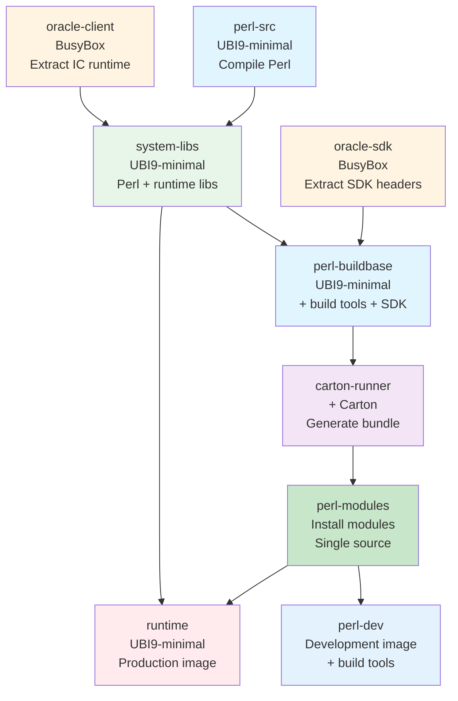

# Perl Multi-Stage Container Build with Carton

Complete multi-stage Podman/Docker workflow for building Perl applications with reproducible, offline-capable dependency management using Carton.

## Key Features

- **Offline CPAN installs**: once a bundle is generated, Perl module installation requires no internet access. Note: the OS-level package installs (`microdnf`) in `perl-src`, `system-libs`, and `perl-buildbase` still require network access or a local package mirror unless those are also vendored.
- **Deterministic Dependencies**: Bundle hash based on `cpanfile.snapshot` ensures reproducibility
- **Version Traceability**: Images tagged with bundle hash for full dependency lineage
- **Minimal Runtime**: Production image contains no compilers, build tools, or Carton
- **Multi-RHEL targeting**: Build for any UBI version (8, 9, 10) via a single `UBI_IMAGE` build arg — UBI9 by default
- **Comprehensive Testing**: bats unit tests, end-to-end Carton→cpm integration tests, and container-level module smoke tests

## Quick Start

### 1. Check Status

```bash
make status
```

Shows current state of dependencies, bundles, and images with color-coded output.

### 2. Generate CPAN Bundle

```bash
make bundle
```

Computes a hash from `cpanfile.snapshot`, builds the carton-runner stage, generates a CPAN mirror bundle, and saves it as `bundles/bundle-<hash>.tar.gz`.

### 3. Build Images

```bash
make all       # Build both dev and runtime images
# or individually:
make dev       # Build development image only
make runtime   # Build runtime image only
```

Images are tagged with bundle hash labels:

- `myapp:dev-<hash>` and `myapp:dev`
- `myapp:runtime-<hash>` and `myapp:runtime`

To target a different RHEL/UBI version (see [Targeting Different RHEL Versions](#targeting-different-rhelubi-versions)):

```bash
make all UBI_IMAGE=registry.access.redhat.com/ubi8/ubi-minimal:8.10
```

### 4. Test Libraries

```bash
# Quick smoke test (verify all modules can be loaded)
make test-load-dev       # Test dev image
make test-load-runtime   # Test runtime image

# Full CPAN test suites (dev only - slow but thorough)
make test-full                    # Run all test suites
make test-full MODULE=DBI         # Test single module
```

**Note:**

- Full test suites only run on `dev` image (runtime lacks build tools)
- Module loading tests work on both dev and runtime

### 5. Run Application

```bash
podman run --rm myapp:dev       # Development image
podman run --rm myapp:runtime   # Production image
```

## Makefile Targets

```bash
make help                     # Show available targets with descriptions
make status                   # Check status of bundles and images
make bundle                   # Generate CPAN bundle from cpanfile.snapshot
make dev                      # Build development image (myapp:dev)
make runtime                  # Build runtime image (myapp:runtime)
make all                      # Generate bundle and build both images
make test-load-dev            # Quick: verify all modules load in dev image
make test-load-runtime        # Quick: verify all modules load in runtime image
make test-full                # Full: run CPAN test suites (parallel, all CPUs)
make test-full MODULE=name    # Full: run CPAN test suite for single module
make clean                    # Remove images (bundles are preserved)
```

All build targets accept an optional `UBI_IMAGE` variable to override the base OS:

```bash
make bundle UBI_IMAGE=registry.access.redhat.com/ubi8/ubi-minimal:8.10
make all    UBI_IMAGE=registry.access.redhat.com/ubi8/ubi-minimal:8.10
```

### Checking Status

The `status` target provides a comprehensive view with color-coded output:

```bash
make status
```

Shows:

- Current cpanfile.snapshot hash and git status
- Bundle existence and version alignment
- Image status with bundle hash labels
- Recommended commands to sync everything

## Typical Use Cases

### First-time setup

Download the pre-built artifacts (Oracle Instant Client zips, Perl source tarball, cpanm and cpm fatpacks) into `artifacts/`, then:

```bash
make bundle    # Build carton-runner image, resolve all CPAN deps, create bundle
make all       # Build dev + runtime images from the bundle
make status    # Verify everything is aligned
```

### Update a single module to latest

Bumps one module's entry in `cpanfile.snapshot` to the latest version satisfying `cpanfile`, leaving all other locked versions unchanged:

```bash
./scripts/bundle-create.sh update --module DBI
make bundle    # Rebuild bundle from updated snapshot
make all       # Rebuild images
```

The `update --module` command uses `carton update MODULE`, not `carton install` — the latter is a no-op if the snapshot already satisfies the cpanfile requirement.

### Update all modules to latest

```bash
./scripts/bundle-create.sh update --all
make bundle
make all
```

### Add a new module

1. Add `requires 'Module::Name';` to `cpanfile`
1. Run `make bundle` — Carton resolves and locks the new module and its deps
1. Run `make all` to rebuild images

The new bundle will have a different hash (the snapshot changed), ensuring full traceability.

### Pin a module to a specific version

Edit `cpanfile` before updating:

```perl
requires 'DBI', '== 1.643';       # exact version
requires 'DBI', '>= 1.643';       # minimum version
requires 'DBI', '>= 1.640, < 2.0'; # version range
```

Then update the snapshot and rebuild:

```bash
./scripts/bundle-create.sh update --module DBI
make bundle && make all
```

### Target a different RHEL/UBI version

XS modules (DBD::Oracle, DBD::Pg, JSON::XS, etc.) are compiled against the glibc and OpenSSL of the base image. If production servers run a different RHEL major version, build with the matching UBI image so the compiled `.so` files load correctly:

```bash
# Build for RHEL 8 hosts (glibc 2.28, OpenSSL 1.1.1)
make bundle UBI_IMAGE=registry.access.redhat.com/ubi8/ubi-minimal:8.10
make all    UBI_IMAGE=registry.access.redhat.com/ubi8/ubi-minimal:8.10

# Build for RHEL 9 hosts (default — glibc 2.34, OpenSSL 3.0)
make bundle
make all

# Build for RHEL 10 hosts (glibc 2.39+, OpenSSL 3.2)
make bundle UBI_IMAGE=registry.access.redhat.com/ubi10/ubi-minimal:10.0
make all    UBI_IMAGE=registry.access.redhat.com/ubi10/ubi-minimal:10.0
```

The `UBI_IMAGE` arg controls the base for `perl-src` and `system-libs` stages; all downstream stages inherit transitively.

### Run the test suite

```bash
# Shell-level unit tests (no containers needed, runs in seconds)
bats tests/bats/

# End-to-end Carton→cpm pipeline test (downloads from CPAN, ~3 min)
# This is also run by CI on every push
cd tests/integration && carton install && carton bundle
# ... see tests/README.md for full steps

# Container-level module smoke test (requires built images)
make test-load-dev
make test-load-runtime

# Full CPAN test suites inside the dev container
make test-full
make test-full MODULE=DBI    # single module
```

## Testing System

The repo has three testing layers. See `tests/README.md` for full details.

### Layer 1 — Shell unit tests (bats)

Fast, no containers, no Oracle artifacts required. Mocks `podman` to assert on the exact command strings the scripts produce.

```bash
bats tests/bats/       # runs all 37 tests, typically <10 seconds
```

Covers: `bundle-create.sh` arg parsing, carton subcommand correctness, workdir correctness (regression guards for historical bugs), `build-image.sh` target routing and UBI_IMAGE passthrough, `status.sh` exit-code paths, project-structure smoke tests.

Run in CI on every push and PR.

### Layer 2 — End-to-end Carton→cpm integration test

Exercises the full dependency pipeline with real CPAN downloads, no containers. Uses a minimal `cpanfile` (4 modules: Try::Tiny, Moo, JSON::XS, DBD::SQLite) with intentionally old pinned versions to validate that `carton update MODULE` is scoped to the requested module and does not update bystanders.

```
tests/integration/
├── cpanfile              # 4 modules, no version pins
├── cpanfile.snapshot     # Try::Tiny pinned to 0.30, DBD::SQLite to 1.74
├── test-load.pl          # loads all 4 modules, prints versions
└── test-load-updated.pl  # same, but asserts Try::Tiny VERSION > 0.30
```

Run by the `integration` CI job on every push and PR (~3 min). Steps mirror the production pipeline exactly:

1. `carton install` — downloads snapshot-pinned versions from CPAN
1. `carton bundle` — builds offline `vendor/cache`
1. `tar czf` — creates bundle tarball (same as `bundle-create.sh`)
1. `cpm install --resolver 02packages,file://vendor/cache` — offline install (same as `perl-modules` Containerfile stage, including the `rm cpanfile.snapshot` step)
1. Module load verification
1. `carton update Try::Tiny` — asserts snapshot entry changed, DBD::SQLite entry unchanged
1. Re-bundle + re-install + load verification from updated bundle

### Layer 3 — Container module smoke tests

Requires built images. Verifies every module in `cpanfile` actually loads inside the container.

```bash
make test-load-dev       # Quick: all modules load in dev image (~5 sec)
make test-load-runtime   # Quick: all modules load in runtime image
make test-full           # Full: run CPAN test suites (parallel, ~5-10 min)
make test-full MODULE=DBI  # Single module test
```

Full test suites only run on the `dev` image (runtime lacks build tools). Reports saved to `test-reports/` with timestamps; detail logs generated for failed modules only.

### Test Configuration

Configure per-module behaviour in `tests/test-config.conf`:

```ini
[ModuleName]
skip_load = yes|no          # Skip in smoke test
skip_test = yes|no          # Skip in full CPAN test suite
reason = text               # Displayed in reports
env.VAR_NAME = value        # Set env before testing
test_command = command      # Override default cpanm invocation
```

Examples:

```ini
[Devel::CheckLib]
skip_load = yes
skip_test = yes
reason = Build-time only dependency

[DBD::Oracle]
env.ORACLE_HOME = /opt/oracle/instantclient
env.LD_LIBRARY_PATH = /opt/oracle/instantclient
reason = Requires Oracle environment
```

See `tests/README.md` for the full format reference.

## Architecture

This project implements a **nine-stage** optimized multi-stage build process with a shared runtime foundation:

### Build Stages Flow


```mermaid
graph TD
    A[perl-src<br/>UBI9-minimal<br/>Compile Perl] --> D[system-libs<br/>UBI9-minimal<br/>Perl + runtime libs]
    B[oracle-client<br/>BusyBox<br/>Extract IC runtime] --> D
    C[oracle-sdk<br/>BusyBox<br/>Extract SDK headers] --> E

    D --> E[perl-buildbase<br/>UBI9-minimal<br/>+ build tools + SDK]
    D --> I[runtime<br/>UBI9-minimal<br/>Production image]

    E --> F[carton-runner<br/>+ Carton<br/>Generate bundle]

    F --> G[perl-modules<br/>Install modules<br/>Single source]

    G --> H[perl-dev<br/>Development image<br/>+ build tools]
    G --> I

    style A fill:#e1f5ff
    style B fill:#fff4e1
    style C fill:#fff4e1
    style D fill:#e8f5e9
    style E fill:#e1f5ff
    style F fill:#f3e5f5
    style G fill:#c8e6c9
    style H fill:#e3f2fd
    style I fill:#ffebee
```

### Stage Flow Explained

**Extraction Stages (BusyBox ~1.5MB):**

- `oracle-client` → Extracts Oracle Instant Client runtime libraries
- `oracle-sdk` → Extracts Oracle SDK headers for DBD::Oracle compilation

**Foundation Stage (UBI9-minimal):**

- `perl-src` → Compiles Perl from source
- `system-libs` → Shared base with Perl + runtime libraries (used by both dev & production)

**Build Stages:**

- `perl-buildbase` → Extends system-libs with build tools
- `carton-runner` → Generates CPAN bundle (Carton isolated here)
- `perl-modules` → Installs all CPAN modules once (DRY principle)

**Final Images:**

- `perl-dev` → Full development environment with build tools (copies modules from perl-modules)
- `runtime` → Minimal production image (copies modules from perl-modules, no build tools)

### Stage Details

#### Stage 1: perl-src (UBI9-minimal)

**Purpose:** Compile Perl from source with custom configuration

- Compiles Perl 5.42.2 with thread support (`-Dusethreads`)
- Builds shared Perl library (`-Duseshrplib`)
- Installs to `/opt/perl`
- Source downloaded to `artifacts/perl-${VERSION}.tar.gz`

#### Stage 2: oracle-client (BusyBox ~1.5MB)

**Purpose:** Extract Oracle Instant Client runtime libraries

- Uses minimal BusyBox image (unzip utility only)
- Extracts `instantclient-basiclite*.zip` → runtime shared libraries
- Base layer discarded; only extracted files (`/opt/oracle/instantclient`) copied forward
- **Layer optimization:** Zip file never reaches final images

#### Stage 3: oracle-sdk (BusyBox ~1.5MB)

**Purpose:** Extract Oracle SDK headers for DBD::Oracle compilation

- Uses minimal BusyBox image (unzip utility only)
- Extracts `instantclient-sdk*.zip` → SDK headers
- Only SDK directory (`/opt/oracle/instantclient-sdk`) copied to perl-buildbase
- **Critical for layer optimization:** Prevents ~80MB zip from polluting dev image layers

#### Stage 4: system-libs (UBI9-minimal)

**Purpose:** Shared runtime foundation for both dev and production

- Copies compiled Perl from `perl-src`
- Copies Oracle Instant Client libraries from `oracle-client` (basiclite only, no SDK)
- Installs runtime system libraries:
  - Database drivers: `libpq`, `mariadb-connector-c`, `libaio`
  - Image processing: `gd`, `libpng`, `libjpeg-turbo`, `freetype`
  - XML/compression: `libxml2`, `libxslt`, `zlib`, `bzip2-libs`, `xz-libs`
  - Core: `openssl-libs`, `expat`, `libdb`
- **NO build tools or -devel packages** (runtime only)
- Used as base for both `perl-buildbase` (adds tools) and `runtime` (uses directly)
- **Guarantees identical runtime environment** between dev and production

#### Stage 5: perl-buildbase (extends system-libs)

**Purpose:** Add build environment for compiling XS modules

- Inherits all runtime libraries from `system-libs`
- Installs build tools: `gcc`, `make`, `perl-core`, `perl-devel`
- Installs development headers (`*-devel` packages matching runtime libs)
- Copies Oracle SDK from `oracle-sdk` stage (**no zip files in layers!**)
- Used for: compiling XS modules, running CPAN tests, building bundles

#### Stage 6: carton-runner (extends perl-buildbase)

**Purpose:** Generate offline CPAN dependency bundle

- Installs `cpanm` (fatpacked) and Carton
- Runs `carton install --deployment` to lock dependencies
- Runs `carton bundle` to create offline CPAN mirror
- Creates `cpan-bundle.tar.gz` with vendor cache
- **Carton isolation:** Carton only exists in this stage (not in dev or runtime)

#### Stage 7: perl-modules (extends perl-buildbase)

**Purpose:** Install all CPAN modules once (single source of truth)

- Extends `perl-buildbase` (needs build tools for XS modules)
- Extracts CPAN bundle from `bundles/bundle-latest.tar.gz`
- Installs all dependencies offline using `cpm` with local resolver
- Cleans up build artifacts (`~/.perl-cpm`, extracted bundle)
- **Result:** Clean `/opt/perl/lib/perl5` with all installed modules
- **DRY principle:** Both `perl-dev` and `runtime` copy from here
- **Layer optimization:** Provides clean source without build artifacts

#### Stage 8: perl-dev (extends perl-buildbase)

**Purpose:** Development image with build tools

- Inherits build tools from `perl-buildbase` (gcc, make, etc.)
- **Copies** installed modules from `perl-modules` stage (no installation!)
- Includes dependency files for reference (`cpanfile`, `cpanfile.snapshot`)
- Full development environment with:
  - All CPAN modules installed
  - Build tools for compiling new modules
  - Development headers for XS modules
- **No zip files** thanks to BusyBox extraction stages

#### Stage 9: runtime (extends system-libs)

**Purpose:** Minimal production image

- Inherits from `system-libs` (clean runtime base, no build tools)
- **Copies** installed modules from `perl-modules` stage (not perl-dev!)
- **Layer efficiency:** Copies from clean source without build tool bloat
- **Minimal attack surface:**
  - NO compilers (`gcc`, `make`)
  - NO build tools or `-devel` packages
  - NO Carton or bundle files
  - NO zip files
- Runs as non-root user: `appuser` (UID 1001)
- Production-ready with smallest footprint

### Key Design Principles

- **Shared Runtime Base**: system-libs ensures dev and production have identical runtime dependencies
- **Single Module Installation (DRY)**: perl-modules stage installs all CPAN modules once
  - Both perl-dev and runtime copy from perl-modules (no duplicate installation)
  - Guarantees identical module versions between dev and production
  - Faster builds: modules installed once, copied twice
- **Layer Optimization**: BusyBox used for extraction-only stages (oracle-client, oracle-sdk)
  - Prevents zip files from polluting image layers
  - Multi-stage COPY only brings extracted files forward
  - ~100x smaller base (1.5MB vs 140MB) for utility stages
- **Build Tool Isolation**: Compilers and build tools isolated to perl-buildbase lineage, never reach runtime
  - Runtime copies from perl-modules (clean) not perl-dev (has build tools)
  - True separation: runtime never inherits from build stages
- **Offline Capability**: Bundle contains complete CPAN mirror for reproducible offline builds
- **Security**: Runtime runs as non-root user with minimal attack surface
- **True Layer Efficiency**: No deleted files wasting space in layer history

## Project Structure

```
.
├── Containerfile              # Multi-stage build definition
├── Makefile                   # Build automation
├── cpanfile                   # Perl dependencies
├── cpanfile.snapshot          # Locked dependency versions
├── app/
│   └── app.pl                 # Application code
├── artifacts/                 # Pre-downloaded build artifacts
│   ├── perl-5.42.2.tar.gz
│   ├── cpanm                  # cpanm fatpack
│   ├── cpm                    # cpm fatpack
│   └── instantclient-*.zip    # Oracle Instant Client
├── scripts/                   # Build and management scripts
│   ├── bundle-create.sh       # CPAN bundle and dependency manager
│   ├── build-image.sh         # Container image builder
│   ├── status.sh              # Bundle and image status checker
│   ├── test-load-modules.sh   # Quick module smoke test runner
│   └── test-run-suites.sh     # Full CPAN test suite runner
├── tests/
│   ├── bats/                  # Shell-level unit tests (bats-core)
│   │   ├── mocks/
│   │   │   └── podman         # Mock podman that logs invocations
│   │   ├── bundle-create.bats # Tests for bundle-create.sh
│   │   ├── build-image.bats   # Tests for build-image.sh
│   │   ├── status.bats        # Tests for status.sh
│   │   └── project-structure.bats  # File/permission smoke tests
│   ├── integration/           # End-to-end Carton→cpm pipeline test
│   │   ├── cpanfile           # Minimal 4-module test deps
│   │   ├── cpanfile.snapshot  # Pinned versions (intentionally old)
│   │   ├── test-load.pl       # Module load verification
│   │   └── test-load-updated.pl  # Post-update load + version assertion
│   ├── test-config.conf       # Per-module container test configuration
│   ├── TestConfig.pm          # Configuration parser
│   ├── module-load-test.pl    # Container smoke test script
│   ├── test-suite-runner.pl   # Full CPAN test suite runner
│   └── README.md              # Test system documentation
├── .github/
│   └── workflows/
│       └── test.yml           # CI: bats + integration jobs
├── bundles/                   # Generated CPAN bundles
│   ├── bundle-<hash>.tar.gz   # Content-addressed bundles
│   └── bundle-latest.tar.gz   # Symlink to latest bundle
└── test-reports/              # Container test reports (gitignored)
    ├── dev-TIMESTAMP-summary.txt
    └── dev-TIMESTAMP-details/
        └── Module.log
```

## Daily Workflow

### Adding New Dependencies

1. Edit `cpanfile` to add new modules
1. Regenerate bundle: `make bundle`
1. Rebuild images: `make all`
1. Quick test: `make test-load`
1. Full test (optional): `make test-full`

The new bundle will have a different hash, ensuring full traceability.

### Updating Existing Dependencies

#### Update to Latest Versions

Use the `bundle-create.sh` script to update to the latest versions:

```bash
# Update all dependencies to latest versions
./scripts/bundle-create.sh update --all

# Update specific module to latest version
./scripts/bundle-create.sh update --module DBI
```

After updating, regenerate the bundle:

```bash
make bundle
```

#### Pin to Specific Version

To update a module to a specific version, manually edit `cpanfile`:

```perl
# Pin to exact version
requires 'DBI', '== 1.643';

# Pin to minimum version
requires 'DBI', '>= 1.643';

# Version range
requires 'DBI', '>= 1.640, < 2.0';
```

Then update the snapshot and regenerate the bundle:

```bash
./scripts/bundle-create.sh update --module DBI
make bundle
```

**Note:** Carton doesn't support version pinning via CLI. Manual cpanfile editing is required for version constraints.

### Debugging Test Failures

When `make test-full` fails:

1. Check the summary output for failed module list
1. Review detailed failure logs in `test-reports/full-TIMESTAMP-details/`
1. Test individual module: `make test-full MODULE=FailedModule`
1. The detail report contains **only failed tests** with full verbose output
1. Configure problematic modules in `tests/test-config.conf`:
   - Skip tests: `skip_test = yes`
   - Set environment: `env.VAR_NAME = value`
   - Use custom command: `test_command = ...`

### Configuring Module Tests

Edit `tests/test-config.conf` to customize test behavior per module:

```bash
# Example: Skip flaky module tests
[Some::Flaky::Module]
skip_test = yes
reason = Tests fail in container but module works fine

# Example: Set environment for database driver
[DBD::Oracle]
env.ORACLE_HOME = /opt/oracle/instantclient
env.LD_LIBRARY_PATH = /opt/oracle/instantclient
```

### Changing Perl Version

1. Download the new Perl source tarball to `artifacts/` (e.g. `perl-5.42.2.tar.gz`)
1. Edit `Containerfile` and change `ARG PERL_VERSION=5.42.2` to the new version
1. Rebuild: `make bundle && make all`

## Technical Details

### Bundle Management

- Bundles are content-addressed by hashing `cpanfile.snapshot`
- Cached bundles are reused if snapshot hasn't changed
- Bundle hash added as image label: `bundle.hash=<hash>`
- Images tagged with bundle hash for full dependency lineage tracing
- Bundles contain: `vendor/` directory, `cpanfile`, and `cpanfile.snapshot`

### Offline Installation

The dev stage uses `cpm` with a local file resolver:

```bash
cpm install --resolver 02packages,file:///build/vendor/cache
```

This ensures builds work completely offline once the bundle is generated.

### Runtime Image

- Based on the `UBI_IMAGE` base (default: `ubi9/ubi-minimal`) for smallest footprint
- Includes only runtime system libraries (no gcc, make, etc.)
- Runs as non-root user `appuser` (UID 1001)
- Contains only Perl installation and application code

### Test Reports

- **Summary reports**: Pass/fail/skip counts, list of failures, brief error context
- **Detail reports**: Full verbose output for **failed tests only** (no noise from passing tests)
- Timestamped: `{dev|runtime}-YYYYMMDD-HHMMSS-{summary|detail}.txt`
- Symlinked: `{dev|runtime}-latest-{summary|detail}.txt` points to most recent

## Requirements

- Podman or Docker
- Bash 4+
- Basic UNIX utilities (sha256sum, tar, readlink)

## Troubleshooting

### Bundle not found

```
[MISSING] Bundle missing: bundle-<hash>.tar.gz
```

**Solution**: Run `make bundle` first to generate the CPAN bundle.

### Build fails with missing dependencies

**Solution**: Ensure all XS module build dependencies are installed in the `perl-buildbase` stage (Containerfile:48-59).

### Test failures

```
[FAIL] Some::Module - Can't locate Some/Module.pm in @INC
```

**Causes**:

- Module failed to install during build
- Missing system library dependency
- Module requires compilation and dev image lacks build tools

**Solution**:

- Check build logs for installation errors
- Add missing system libraries to `perl-buildbase` or `runtime` stages
- For dev image: ensure bundle includes all dependencies
- Check `test-reports/*-latest-detail.txt` for full error output

### Permission issues

**Cause**: Runtime image runs as non-root user `appuser` (UID 1001)

**Solution**: Ensure application files and directories have appropriate permissions, or adjust the USER directive in Containerfile

### Image doesn't exist when testing

```
ERROR: Image myapp:dev does not exist
```

**Solution**: Build the image first: `make dev` or `make runtime`

### Image has no bundle hash label

```
[WARNING] myapp:dev (no bundle hash label)
```

**Cause**: Image was built before bundle hash labels were added

**Solution**: Rebuild the image: `make dev` or `make runtime`

## Advanced Customization

### Targeting Different RHEL/UBI Versions

The `UBI_IMAGE` build argument controls the base OS for the `perl-src` and `system-libs` stages. All downstream stages inherit transitively, so a single arg retargets the entire build — compiled Perl, all XS modules, and the runtime image.

```bash
# RHEL 8 / UBI 8 (glibc 2.28, OpenSSL 1.1.1)
make bundle UBI_IMAGE=registry.access.redhat.com/ubi8/ubi-minimal:8.10
make all    UBI_IMAGE=registry.access.redhat.com/ubi8/ubi-minimal:8.10

# RHEL 9 / UBI 9 — default (glibc 2.34, OpenSSL 3.0)
make bundle
make all

# RHEL 10 / UBI 10 (glibc 2.39+, OpenSSL 3.2)
make bundle UBI_IMAGE=registry.access.redhat.com/ubi10/ubi-minimal:10.0
make all    UBI_IMAGE=registry.access.redhat.com/ubi10/ubi-minimal:10.0
```

XS modules (DBD::Oracle, DBD::Pg, JSON::XS, etc.) are compiled against the glibc and OpenSSL of the chosen base image. Match this to the production host OS to avoid `undefined symbol` errors at runtime.

### Adjust Build Dependencies

Modify the `microdnf install` command in the `perl-buildbase` stage to add or remove system library build headers.

### Configure Perl Compilation

Edit the `./Configure` flags in the `perl-src` stage for different Perl options:

- `-Dusethreads` — enable iThreads (adds per-call overhead; only set if the app uses threads)
- `-Duseshrplib` — build shared Perl library
- `-Dprefix=/opt/perl` — installation path

### Customize Test Configuration

See `tests/README.md` for the full format reference on:

- Skipping modules from the container smoke test or full CPAN suites
- Setting per-module environment variables
- Using custom test commands
- Understanding test report format

## License

This project structure is provided as-is for demonstration purposes.
