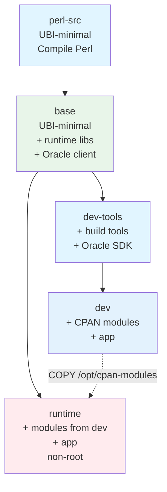
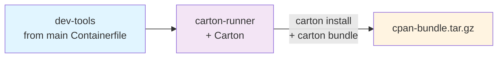

# Architecture

The main `Containerfile` is a **five-stage** build. Bundle regeneration (running Carton to update the offline CPAN mirror) lives in a separate `Containerfile.deps` that `FROM`s the same `dev-tools` stage the `dev` image uses, so the XS build toolchain lives in exactly one place.

## Build Stages Flow



Separately, `Containerfile.deps` reuses `<IMAGE_NAME>:dev-tools` (same layer `dev` builds on) to (re)generate the CPAN bundle:



## Stage Details

### Stage 1: `perl-src`

Compiles Perl from source with `-Dusethreads` and `-Duseshrplib`, installs to `/opt/perl`. Isolated as its own stage because the compile is expensive (~10 min) and rarely changes — a legitimate cache boundary. Source read from `artifacts/perl-${PERL_VERSION}.tar.gz`.

### Stage 2: `base`

The shared foundation for `dev` and `runtime`.

- Copies compiled Perl from `perl-src`
- Installs runtime system libraries only, generated from `lib-packages.conf` (column 1) — see [Adjust Build Dependencies](#adjust-build-dependencies) for the full list and why each one's there
- Extracts Oracle Instant Client runtime libraries from `artifacts/instantclient-basiclite*.zip`. `unzip` is installed transiently and removed in the same layer, so no zip and no unzip binary ships in this image.
- Sets `PATH`, `PERL5LIB`, `LD_LIBRARY_PATH`, `ORACLE_HOME`
- Contains **no** compilers, `-devel` headers, or Oracle SDK.

Because both `dev` and `runtime` `FROM base`, any runtime library present in one is present in the other with the same version.

### Stage 3: `dev-tools`

The shared build-toolchain layer. Adds compilers, `-devel` headers, and the Oracle SDK on top of `base`. Contains **no CPAN modules and no application code**.

- Installs build tools + `-devel` headers (`gcc`, `make`, `perl-core`, `perl-devel`, plus `-devel` packages matching each runtime lib in `base`)
- Extracts the Oracle SDK from `artifacts/instantclient-sdk*.zip` into `/opt/oracle/instantclient/sdk`

Both the `dev` stage (which extends `dev-tools` with CPAN modules and the app) and `Containerfile.deps` (which extends `dev-tools` with Carton) share this layer. The toolchain package list lives in exactly one place; edits stay in sync automatically.

### Stage 4: `dev`

The development image. Inherits `dev-tools`, installs the CPAN modules, and copies the app.

- Installs all CPAN modules **offline** from `bundles/bundle-latest.tar.gz` into `/opt/cpan-modules` using `cpm --resolver "02packages,file://.../vendor/cache"`. The bundle is the pinned, content-addressed offline CPAN mirror produced by `make bundle`.
- Copies the application code into `/app`

The `/opt/cpan-modules` tree is the artifact that `runtime` copies from — modules are installed exactly once.

### Stage 5: `runtime`

The production image. Inherits `base` (not `dev` or `dev-tools`), so it starts from the same clean runtime lineage and picks up only what it needs.

- Copies `/opt/cpan-modules` from `dev`
- Copies the application code into `/app`
- Creates non-root user `appuser` (uid 1001) via a transient `shadow-utils` install
- No compilers, `-devel` packages, Carton, cpanm, or bundle files
- Based on the `UBI_IMAGE` base for smallest footprint; contains only the Perl installation and application code

## `Containerfile.deps` — bundle regeneration

A small file layered on top of `<IMAGE_NAME>:dev-tools` — the same layer the `dev` stage builds on, so the XS toolchain (gcc, `-devel` headers, Oracle SDK) is defined exactly once in the main Containerfile. `Containerfile.deps` adds Carton on top and runs `carton install && carton bundle` to produce the offline CPAN mirror tarball at `/build/cpan-bundle.tar.gz`. `scripts/deps.sh` extracts that tarball into `bundles/bundle-<hash>.tar.gz` (hash from `cpanfile.snapshot`) and updates the `bundle-latest.tar.gz` symlink, alongside a `bundle-<hash>.build-info` sibling recording the `PERL_VERSION`/`UBI_IMAGE` pairing it was built against.

This is only invoked by `make bundle`, `make update`, and `make update-all`. Normal image builds never touch this file.

## Key Design Principles

- **Identical runtime libraries between dev and runtime.** Both `dev` and `runtime` reach `base` in their lineage, so anything installed via `microdnf` in `base` is bit-identical across both images.
- **Modules built once, copied to runtime.** `dev` installs to `/opt/cpan-modules`; `runtime` copies. No duplicate installation, guaranteed version parity.
- **Build tools never reach runtime.** `runtime FROM base` (not `dev` or `dev-tools`), and only `/opt/cpan-modules` is copied from `dev`.
- **Toolchain defined once.** `dev-tools` is the shared ancestor of `dev` and `Containerfile.deps`; the `-devel` package list and Oracle SDK extraction exist in one place.
- **Offline reproducible builds.** Once the bundle exists, `make dev`/`make runtime` need no CPAN network access. The bundle is content-addressed by SHA-256 of `cpanfile.snapshot`; images are labeled with the bundle hash for lineage tracing.
- **Bundle regeneration is separated.** Carton lives only in `Containerfile.deps`, so the main `Containerfile` DAG stays linear (`perl-src` → `base` → `dev-tools` → `dev`, with `runtime` branching from `base`).
- **Non-root runtime.** `runtime` executes as `appuser` (uid 1001).

## Bundle Management

- Bundles are content-addressed by hashing `cpanfile.snapshot`
- Cached bundles are reused if the snapshot hasn't changed
- Bundle hash added as image label: `bundle.hash=<hash>`
- Images tagged with bundle hash for full dependency lineage tracing
- Bundles contain: `vendor/` directory, `cpanfile`, and `cpanfile.snapshot`
- Each bundle has a sibling `bundle-<hash>.build-info` (symlinked as `bundle-latest.build-info`) recording the `PERL_VERSION` and `UBI_IMAGE` it was built against — compiled XS modules are ABI-bound to both, not just the Perl version. Consumed by the VM deployment gate in [`vm-deployment.md`](vm-deployment.md)

The `dev` stage installs offline via a local file resolver:

```bash
cpm install --resolver 02packages,file:///build/vendor/cache
```

This ensures builds work completely offline once the bundle is generated.

## Targeting Different RHEL/UBI Versions

XS modules (`DBD::Oracle`, `DBD::Pg`, `JSON::XS`, etc.) are compiled against the glibc and OpenSSL of the base image. If production servers run a different RHEL major version, build with the matching UBI image so the compiled `.so` files load correctly — mismatching this is the same class of ABI failure the [VM deployment version-compatibility gate](vm-deployment.md#version-compatibility-gate--check-this-before-installing) exists to catch on the perlbrew side.

The `UBI_IMAGE` build argument controls the base OS for the `perl-src` and `base` stages; the `dev-tools`, `dev`, and `runtime` stages inherit transitively, so a single arg retargets the entire build — compiled Perl, all XS modules, and the runtime image.

```bash
# RHEL 8 / UBI 8 (glibc 2.28, OpenSSL 1.1.1)
make bundle UBI_IMAGE=registry.access.redhat.com/ubi8/ubi-minimal:8.10
make all    UBI_IMAGE=registry.access.redhat.com/ubi8/ubi-minimal:8.10

# RHEL 9 / UBI 9 — default (glibc 2.34, OpenSSL 3.0)
make bundle
make all

# RHEL 10 / UBI 10 (glibc 2.39+, OpenSSL 3.2)
make bundle UBI_IMAGE=registry.access.redhat.com/ubi10/ubi-minimal:10.0
make all    UBI_IMAGE=registry.access.redhat.com/ubi10/ubi-minimal:10.0
```

Match this to the production host OS to avoid `undefined symbol` errors at runtime.

## Changing Perl Version

`cpanfile.snapshot` and `ARG PERL_VERSION` are a pair, not independent: the snapshot's pinned versions — several of them compiled XS modules — are only known-good against the Perl (and OS, per above) they were resolved under. Bumping the version without re-resolving risks a pinned distribution silently failing to build against the new Perl.

1. Download the new Perl source tarball to `artifacts/` (e.g. `perl-5.42.2.tar.gz`)
1. Edit `Containerfile` and change `ARG PERL_VERSION=5.28.1` to the new version
1. **Re-resolve the snapshot against the new Perl**: `make update-all` (or `make update MODULE=Name` / `MODULE="Name1 Name2"` for a narrower bump) — this is the step it's easy to skip, and skipping it means the "new" bundle is still built from the old Perl's dependency resolution
1. Rebuild: `make bundle && make all`
1. `make test-full` before trusting the result — a clean re-resolution doesn't guarantee every XS module still compiles cleanly under the new toolchain

`make bundle` stamps the actual `PERL_VERSION`/`UBI_IMAGE` pairing into `bundle-<hash>.build-info` regardless of whether you followed this checklist, so at least the mismatch is visible after the fact — see [`vm-deployment.md`](vm-deployment.md#version-compatibility-gate--check-this-before-installing) for how a downstream consumer checks it.

## Adjust Build Dependencies

Per-library runtime/`-devel` package pairs live in `lib-packages.conf` at the repo root, not hardcoded separately in `base` and `dev-tools` — both stages generate their `microdnf install` list from it (`base` reads column 1, `dev-tools` column 2), so the two can't silently drift apart. Each entry's third column documents which cpanfile module(s) actually need it. To add a library: add one line there. To change the generic build toolchain (`gcc`, `make`, compilers, etc. — not per-library, so not in the manifest), edit the `dev-tools` stage's other `RUN microdnf install` block directly. `Containerfile.deps` `FROM`s `dev-tools`, so either change picks up automatically in the bundle-regeneration path too.

## Configure Perl Compilation

Edit the `./Configure` flags in the `perl-src` stage for different Perl options:

- `-Dusethreads` — enable iThreads (adds per-call overhead; only set if the app uses threads)
- `-Duseshrplib` — build shared Perl library
- `-Dprefix=/opt/perl` — installation path
